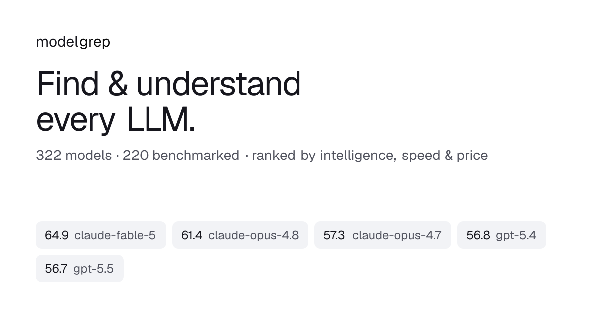

<div align="center">

<a href="https://modelgrep.com"></a>

# modelgrep

**Find and understand every LLM.** Compare 300+ models by benchmark, speed, latency, price, context and capability — in one place.

[](https://modelgrep.com)
[](https://modelgrep.com/api)
[](https://nextjs.org)
[](https://www.typescriptlang.org)
[](https://github.com/sculptdotfun/modelgrep/stargazers)

[**modelgrep.com**](https://modelgrep.com) · [**API docs**](https://modelgrep.com/api)

</div>

modelgrep aggregates [OpenRouter](https://openrouter.ai)'s catalog with independent benchmarks, live performance and pricing so you can compare large language models by intelligence, speed, latency, cost, context and capability.

---

## What it does

- **Leaderboard** — every model, filterable by capability (reasoning, tools, vision, JSON), price, context and provider, sortable on any metric.
- **Rankings** — data-backed "best LLM for X" pages: smartest, coding, design, fastest, cheapest, free, reasoning, vision, agents, long-context, open-source — and each scoped per maker (e.g. *fastest Anthropic model*).
- **Compare** — side-by-side model vs. model.
- **Makers & model pages** — per-provider breakdowns with live throughput, latency, uptime and per-endpoint pricing.
- **Free public API** — the same data as read-only JSON, no key required.

## Data sources

| Source | Provides |
| --- | --- |
| OpenRouter | Base catalog, pricing, capabilities, providers, live throughput & latency |
| Artificial Analysis | Intelligence / Coding / Agentic index scores (GPQA, SWE-bench, SciCode, Tau²…) |
| Design Arena | Head-to-head Elo for UI / frontend / design generation |

Performance refreshes hourly; benchmarks daily. All enrichment is cached so the heavy fan-out runs once per revalidate window.

## API

Free, read-only, no API key, CORS-enabled. Base URL: `https://modelgrep.com/api/v1`

```bash
# Cheapest vision models under $1 / M tokens
curl "https://modelgrep.com/api/v1/models?capabilities=vision&max_price=1&sort=price_input&limit=5"

# Best Anthropic model for coding (ranked + one-sentence answer)
curl "https://modelgrep.com/api/v1/rankings/coding/anthropic"
```

| Endpoint | Description |
| --- | --- |
| `GET /api/v1` | Self-describing discovery doc |
| `GET /api/v1/models` | List, filter, sort & paginate the catalog |
| `GET /api/v1/models/{id}` | Single model + per-provider breakdown |
| `GET /api/v1/rankings/{collection}[/{maker}]` | "Best LLM for X" ranking |
| `GET /api/v1/makers` | Makers with counts & headline models |

Full reference: **[modelgrep.com/api](https://modelgrep.com/api)**

## Tech stack

- [Next.js 16](https://nextjs.org) (App Router, ISR) · [React 19](https://react.dev) · [TypeScript](https://www.typescriptlang.org)
- [Tailwind CSS v4](https://tailwindcss.com) · [Zustand](https://zustand-demo.pmnd.rs) · [lucide-react](https://lucide.dev)
- Programmatic SEO/AEO: per-page JSON-LD, BLUF answer blocks, sitemap, structured FAQs
- Deployed on [Railway](https://railway.app)

## Local development

Requires Node 22 (see `.nvmrc`) and [pnpm](https://pnpm.io).

```bash
pnpm install
pnpm dev        # http://localhost:3000
```

```bash
pnpm build      # production build (fetches live catalog)
pnpm start      # serve the production build
```

No environment variables or API keys are needed — all upstream sources are keyless.

## Project layout

```
app/        Next.js routes — leaderboard, /best, /compare, /makers, /models, /api
components/  UI (Dashboard, ModelTable, AnswerBox, SiteNav…)
lib/         Data layer — openrouter client, catalog cache, collections, facets, api
```

## License

Unofficial, independent project — not affiliated with OpenRouter, Artificial Analysis or Design Arena.
